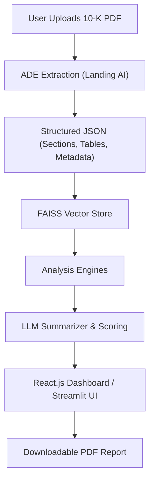

# CrediLens: Intelligent Credit & Company Analysis System
**Tagline:** *Upload a 10-K. Get a 360° Credit & Company Snapshot — instantly.*

---

## Table of Contents
- [Overview](#overview)
- [System Architecture](#system-architecture)
- [Pipeline Flow](#pipeline-flow)
- [Key Components](#key-components)
- [Data & Configurations](#data--configurations)
- [Frontend (React.js)](#frontend-reactjs)
- [Backend (FastAPI + ADE)](#backend-fastapi--ade)
- [Setup & Quickstart](#setup--quickstart)
- [Deployment (Docker)](#deployment-docker)
- [API Endpoints](#api-endpoints)
- [Evaluation & Scoring](#evaluation--scoring)
- [Directory Structure](#directory-structure)
- [Developer Workflow](#developer-workflow)
- [Future Enhancements](#future-enhancements)
- [License & Citation](#license--citation)

---

## Overview

**CrediLens** is a **multimodal agentic RAG** platform that transforms complex **corporate filings (10-K/Annual Reports)** into structured, interpretable insights on **credit health, business fundamentals, and risk exposure**.

The system integrates:
- **Landing AI’s Agentic Document Extraction (ADE)** for structured extraction of sections, tables, and narratives.  
- **LLM reasoning (OpenAI / Gemini)** for contextual summarization and analysis.  
- **FAISS vector retrieval** for grounding conversational responses on extracted text.  
- **Interactive React.js dashboard** for visualization, AI-driven summaries, and downloadable reports.

  

>  **Disclaimer:** This is **not** a financial advisory or credit-rating tool. This is merely intended to aid in the analyses of relevant factors as a part of decision making.


---
## Sample Outputs


**Dashboard Overview**
- Credit Health Score card (e.g., **56 – Weak**)
- Gauges for **Liquidity**, **Leverage**, and **Cash stress**
- **Pillar Scores** bar chart (e.g., Profitability, Data quality)
- **Score Composition** pie chart
- **Financial & Credit Snapshot** table with per‑ratio comments


**Detail View**
- **Products & Services** list
- Highlighted **Risk Factors** (free‑text extracted via ADE)
- **Management Discussion** excerpt (from MD&A)
- Right‑side **ratio grid** (Current/Quick/Cash/Gross Margin, etc.) with Good/Moderate/Bad badges


---


## System Architecture

The architecture merges multimodal extraction, LLM summarization, and interactive visualization.

### High-Level Overview


### Core Technologies
| Layer | Technology | Purpose |
|-------|-------------|----------|
| Frontend | **React.js + TailwindCSS + Vite** | Interactive dashboard and chatbot UI |
| Backend | **FastAPI (Python)** | API for ADE, vector search, and LLM queries |
| Document Extraction | **Landing.ai ADE** | Agentic extraction of tables, text, and sections |
| Retrieval | **FAISS** | Vector-based document retrieval |
| Models | **OpenAI GPT-4o / Gemini 1.5** | Summarization, ratio interpretation, chat responses |
| Storage | **YAML / JSON cache + Static uploads** | Temporary storage for extracted data |
| Reporting | **ReportLab / HTML-to-PDF** | Downloadable financial intelligence report |

---

## Pipeline Flow

| Stage | Description | Modules |
|--------|--------------|----------|
| **1. Upload** | User uploads a 10-K/Annual report (PDF). | `templates/index.html`, `static/uploads/` |
| **2. ADE Extraction** | Landing.ai ADE extracts key sections (Business, MD&A, Risk Factors, Financials). | `credilens/agents/pipeline.py` |
| **3. Structuring** | Extracted data normalized into schema for JSON/YAML storage. | `credilens/schemas/models.py` |
| **4. Ratio & Scoring** | Computes financial ratios and credit health score (0–100). | `credilens/engines/ratio_engine.py`, `scoring_engine.py` |
| **5. Knowledge Graph Mapping** | Links business entities and risk factors. | `credilens/engines/kg_engine.py` |
| **6. LLM Summaries** | Generates human-readable summaries and interpretations. | `credilens/engines/summary_engine.py` |
| **7. Visualization & Chat** | Frontend dashboard displays charts, summaries, and a side chatbot. | `backend/server.js`, `templates/dashboard.html` |
| **8. Report Generation** | Creates downloadable professional report (company logo, key ratios). | `app.py` |

---

## Key Components

### 🧠 Agents & Engines
- **`credilens/agents/pipeline.py`** – Main orchestrator integrating ADE, vector store, and summarizer.  
- **`credilens/engines/ratio_engine.py`** – Computes liquidity, leverage, profitability ratios.  
- **`credilens/engines/scoring_engine.py`** – Derives overall credit health score from weighted metrics.  
- **`credilens/engines/summary_engine.py`** – Generates textual explanations per financial aspect.  
- **`credilens/engines/kg_engine.py`** – Builds a relationship graph between risk, operations, and revenue.  

### 🧩 Rules & QA
- **`credilens/rules/fields.py`** – Maps extracted ADE fields to financial schema.  
- **`credilens/rules/ratios.py`** – Contains standard financial ratio formulas.  
- **`credilens/qa/checks.py`** – Validates completeness of extracted data.  
- **`credilens/qa/provenance.py`** – Maintains traceability to the original ADE sections.  

---

## Data & Configurations

| File | Description |
|------|--------------|
| `data/config/risk_taxonomy.yaml` | Categorization of risk keywords and severity. |
| `data/config/scoring.yaml` | Weighted model for credit scoring. |
| `data/examples/dummy_extracted_10k.yaml` | Example ADE extraction. |
| `data/examples/golden_ratios.json` | Benchmark ratios for calibration. |

---

## Frontend (React.js)

- Located in `/backend/`
- Built with **Vite + TailwindCSS**
- Provides a clean, **glass-panel UI** featuring:
  - Company summary cards
  - Credit score gauge
  - Key ratio tables
  - Risk visualization
  - Chatbot for “Explain this section” queries

### Run Frontend
```bash
cd backend
npm install
npm run dev
```

---

## Backend (FastAPI + ADE)

The FastAPI backend (`app.py`) orchestrates:
- ADE PDF upload & structured extraction
- FAISS vector embedding + retrieval
- Query answering via OpenAI/Gemini
- Report PDF export

### Run Backend
```bash
pip install -r requirements.txt
uvicorn app:app --reload
```

Environment variables in `.env`:
```bash
OPENAI_API_KEY=your_key
LANDING_API_KEY=your_key
FAISS_INDEX=./data/faiss_index
```

---

## Setup & Quickstart

### 1. Install dependencies
```bash
pip install -r requirements.txt
```

### 2. Environment setup
```bash
cp .env.example .env
# Add your API keys for OpenAI and Landing.ai
```

### 3. Start backend
```bash
python app.py
```

### 4. Start frontend
```bash
cd backend
npm install
npm run dev
```

Access the app at **http://localhost:5173** (frontend) or **http://127.0.0.1:8000** (API).

---

## Deployment (Docker)

### Build and Run
```bash
docker build -t credilens .
docker run -p 8000:8000 credilens
```

### Example `Dockerfile`
```dockerfile
FROM python:3.11
WORKDIR /app
COPY . .
RUN pip install -r requirements.txt
CMD ["uvicorn", "app:app", "--host", "0.0.0.0", "--port", "8000"]
```

---

## API Endpoints

| Method | Endpoint | Description |
|--------|-----------|-------------|
| POST | `/upload` | Uploads 10-K PDF for ADE processing |
| GET | `/analyze` | Returns structured JSON of extracted data |
| GET | `/score` | Returns credit score and risk metrics |
| POST | `/chat` | LLM-based interaction endpoint |
| GET | `/health` | Health check |

---

## Evaluation & Scoring

The platform computes a **Credit Health Score (0–100)** based on:
- Liquidity, leverage, profitability ratios  
- Textual risk indicators  
- Year-over-year trend direction  

Optional evaluation metrics for RAG quality:
- **BLEU / ROUGE / BERTScore** for textual accuracy  
- **Expert validation** for financial interpretation quality  

---

## Directory Structure

```
credilens.app-main/
│   app.py
│   config.py
│   requirements.txt
│   .env.example
│
├───credilens/
│   ├── agents/            # Orchestration pipeline
│   ├── engines/           # Ratio, scoring, summary, KG engines
│   ├── qa/                # Quality assurance and provenance
│   ├── rules/             # Ratio formulas & field mappings
│   └── schemas/           # Data models and schema definitions
│
├───backend/               # React + Tailwind frontend
├───data/                  # Configs and example extracted data
├───templates/             # HTML templates (Flask rendering)
├───static/                # CSS and uploaded PDFs
└───__pycache__/
```

---

## Developer Workflow

1. **Extend Extraction Logic**  
   - Modify `credilens/agents/pipeline.py` to add new ADE mappings.  
2. **Enhance Ratio Computation**  
   - Update `credilens/rules/ratios.py` or `scoring.yaml`.  
3. **Improve LLM Responses**  
   - Tune prompts in `credilens/engines/summary_engine.py`.  
4. **Refine Frontend Visualization**  
   - Edit React components in `/backend/src/`.  
5. **Test Locally**  
   - Run both backend and frontend; verify `/health` endpoint.  

---

## Future Enhancements

- Integration with **LangChain Agents** for deeper cross-filing analysis  
- Add **Company-to-Peer comparison** dashboards  
- Deploy **vector-aware chatbot** using multi-modal context (charts + text)  
- Enable **multi-file ingestion** (10-K, 10-Q, 8-K) for longitudinal trend visualization  

---


